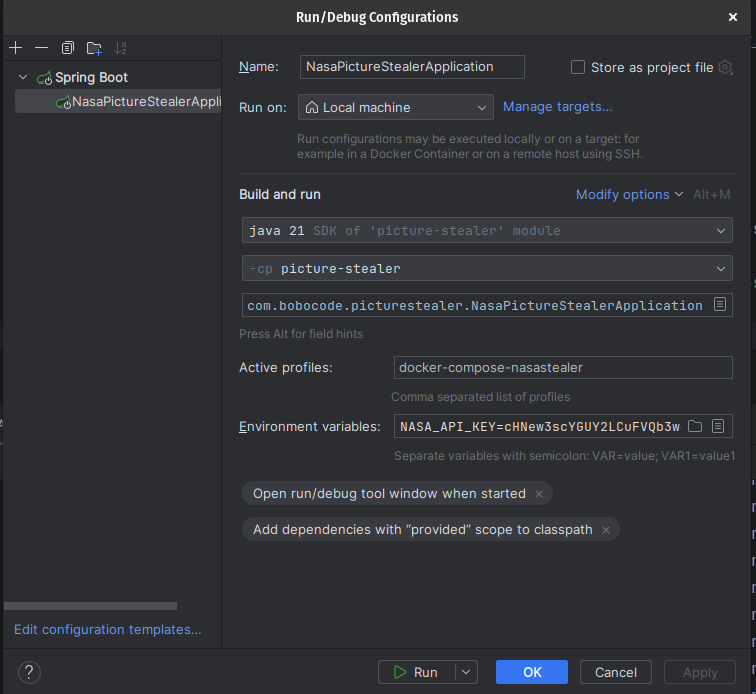

# Getting Started

### Reference Documentation

For further reference, please consider the following sections:

* [Official Apache Maven documentation](https://maven.apache.org/guides/index.html)
* [Spring Boot Maven Plugin Reference Guide](https://docs.spring.io/spring-boot/docs/3.2.0/maven-plugin/reference/html/)
* [Create an OCI image](https://docs.spring.io/spring-boot/docs/3.2.0/maven-plugin/reference/html/#build-image)
* [Spring Data JPA](https://docs.spring.io/spring-boot/docs/3.2.0/reference/htmlsingle/index.html#data.sql.jpa-and-spring-data)
* [Docker Compose Support](https://docs.spring.io/spring-boot/docs/3.2.0/reference/htmlsingle/index.html#features.docker-compose)
* [Spring Web](https://docs.spring.io/spring-boot/docs/3.2.0/reference/htmlsingle/index.html#web)
* [Spring Reactive Web](https://docs.spring.io/spring-boot/docs/3.2.0/reference/htmlsingle/index.html#web.reactive)
* [Flyway Migration](https://docs.spring.io/spring-boot/docs/3.2.0/reference/htmlsingle/index.html#howto.data-initialization.migration-tool.flyway)

### Description
This Java application is designed to steal pictures from NASA. It is built using the Spring Boot framework, making it easy to create stand-alone, production-grade Spring-based applications.

## Installation
### Docker Compose support
A  typical workflow with Docker Compose is to run `docker compose up`, work on your application with it connecting to 
started services, then run `docker compose down` when you are finished.

This project supports a [Spring Boot Docker Compose](https://docs.spring.io/spring-boot/docs/current/reference/htmlsingle/#features.docker-compose)

Defined file `docker-compose.yaml`.
In this file, the following services have been defined:

* postgres-15: [`postgres:15.5`](https://hub.docker.com/_/postgres)

Spring application will manage the starting and stopping of Docker Compose services. When the Spring application starts, it will also start the services defined in the Docker Compose file, and when the application stops, it will stop these services.

To run the project with automated management, activate the `docker-compose-nasastealer` profile, which will manage the Docker container's lifecycle.



Also, be sure to pass the `${NASA_API_KEY}` environment variable at startup, which is required for nasa server-side authorization
As a result of the launch, the `nasastealer` scheme with all relevant tables will be created in the `bobocode` database

### Manual installation
You can also run docker-compose manually. To do this, you need to run the following commands in the root directory of the project:
```shell 
docker compose up -d
```
Then there is no need to specify anything in the active profile when starting the spring boot application.
As a result of the launch, the `nasastealer` database will be used, with all relevant tables created in the `public` schema


